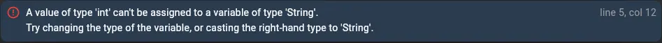

In the vast universe of programming, **each language has its own structure and style**, marking its distinctive identity and usefulness. On this journey towards **Dart introduction**, we will delve into the **fundamental concepts** that build the foundations of this modern and powerful language.

Dart, a language developed by Google, has quickly gained popularity thanks to its **versatility and efficiency**. It is the primary programming language **used in Flutter**, the open source framework for creating applications for mobile, web, desktop, even embedded systems. Before we dive into creating interactive and dynamic applications, it is essential to understand the most basic building blocks: **variables and data types**.

Get ready to discover how Dart makes data management an **intuitive and powerful experience**. Ok, let's begin our journey into the heart of software development with Dart.

# Variables

> Variables in dart are simply containers of data.

Maybe now is a good time to introduce myself, **my name is Lucas**. That is information that as human beings we hear frequently or I could tell you that i live in Paraguay or that my ambition is to see all the movies made in history, but if you are a computer, this information **is better saved in a variable**. The complete line of code looks like this:

```dart
var myName = 'Lucas';
```

*var* is a keyword that says i'm **creating a variable**, then i give that variable a name, in this case it's called *myName* and i set what that variable is equal to in this case it's *'Lucas'*, and everything else as the point and comma or equal sign are **just syntax**.

The syntax is just computer grammar, just like we would have commas, periods, colons in English or Spanish language, **computers also have their own grammar** and this grammar differs from programming language to another but in Dart this is how it looks when you create a new variable.

## What is really happening here?

Essentially when i type the *var* keyword, the computer **builds a box**, then looks at what name to give that box, in this case it's *myName*; and then looks at the right side of the equal sign to see **what to put inside the box**, in this case it's the word *'Lucas'* and the semicolon just says that it is the end of this line of code, so **the computer can close the box**.

Now imagine you have a **shelf** and as you create more and more variables you will **build more shelves full of these boxes**, and when you need one you can go, find the box, take it off the shelf and **open it to see what's inside**.

So, for example if i wanted to print the value of the variable i just created, this is how i would write:

```dart
print(myName);
```

I would use the *print* function and **inside the parentheses** i would tell it what i want to print and in this case it is actually not the words myName that will print, **it is the value of that variable that will print**, so when you run this line of code, the computer will take the box labeled myName from the shelf, open it, see what's inside, and place it on the console. What you will actually see is the Flutter output that says the word *'Lucas'*.

## For better understanding...

Now so you can try this for yourself and don't have to just rely on what I'm telling you, please go to <a href="https://dartpad.dev/" target="_blank">DartPad</a>, you are going to find something like this:

```dart
void main() {
  for (int i = 0; i < 10; i++) {
    print('hello ${i + 1}');
  }
}
```

Now I want you to delete everything except the **void main**, you will have something like this:

```dart
void main() {
  
}
```

Just so you know, that's a function, and that's the function that acts as **the entry point** for all of our programs in dart, and now you're telling it to do nothing when it starts, so when you hit *run*, nothing happens.

> We will see what the functions are in the next post

**Inside the main function**, declare a variable called *myName* and initialize it with the **String** value *'yourName'* (if your name is Anya, that's what you'll have to put inside the single quotes). In Dart, Strings are defined using single quotes, although you can also use double quotes if you are coming from other programming languages. However, **it is a convention in Dart to prefer single quotes**. Finally, be sure to end the line of code with a semicolon.

Once your variable is created, you can use it and to use it, you have to reference the name of the variable, so now write a *print* function and **inside it use the variable that you created** and also close that line of code with a semicolon . You should have something like this:

```dart
void main() {
  var myName = 'your_name';
  print(myName);
}
```

Now, click on the *run* button and you should see your name in the console, which is the value of the variable you created:

```
your_name
```

If later you would like to change the name, because you don't like the one you have now, or if you want to change the value that that variable stores, you can simply **reassign it**.

```dart
void main() {
  var myName = 'your_name';

  myName = 'Meryl';
}
```

And what will happen is that the computer **will look** for that box that is labeled *myName*, take its old value inside and put in the new value, so now **your name is equal to Meryl**.

If you now wanted to print the value of that variable, you would move the *print* function below the new assignment: 

```dart
void main() {
  var myName = 'your_name';

  myName = 'Meryl';
  print(myName);
}
```

What do you think will be printed to the console now? Will it be your old name or will it be Meryl? Press the run button.

**Congratulations if you got it right!** 

In Dart, when you are inside a function, which is **delimited by a set of curly braces**, the code is executed sequentially, **from top to bottom**. If you put the *print* function below the first assignment again, it will print *'your_name'*, since at that point that is still the assigned value. You then **reassign** the value to be equal to *'Meryl'*, and printing it again will display this new value:

```dart
void main() {
  var myName = 'your_name';
  print(myName);

  myName = 'Meryl';
  print(myName);
}
```

Press the run button and you can see it in action.

## What if...?

What would happen if you decided to change the **value** of this variable to something a little different like a **number**? Let's say you change it to *123*.

```dart
void main() {
  var myName = 'your_name';
  print(myName);

  myName = 123;
  print(myName);
}
```

Right now DartPad should be showing you an error like this:



and if you click run everything fails and you have some errors in your console saying this:

```
compileDDC
main.dart:5:12: Error: A value of type 'int' can't be assigned to a variable of type 'String'.
  myName = 123;
    ^
```

So, what is an **int** and why can't it be assigned to a **String**?